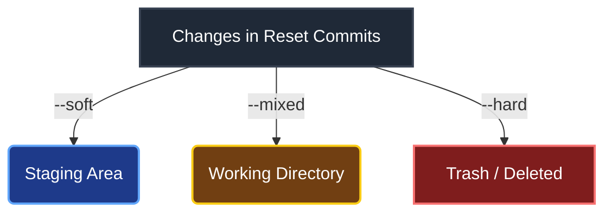

import Tooltip from "@site/src/components/Tooltip";

# اصلاح خطاها و نجات (Error Correction)

همه ما اشتباه می‌کنیم. خوشبختانه گیت تقریباً برای هر اشتباهی یک راه بازگشت دارد. در این بخش یاد می‌گیریم چگونه خرابکاری‌ها را تمیز کنیم، فایل‌های حذف شده را برگردانیم و حتی اگر تاریخچه را پاک کردیم، آن را بازیابی کنیم.

## ۱. اصلاح آخرین کامیت (`--amend`)

**سناریو:** کامیت کردید ولی یادتان رفت یک فایل را اضافه کنید، یا پیام کامیت غلط املایی دارد.

به جای اینکه یک کامیت جدید با پیام "Fix typo" بزنید، می‌توانید کامیت قبلی را اصلاح کنید:

```bash
git add forgotten-file.js
git commit --amend
```

اگر فقط می‌خواهید پیام را عوض کنید:
```bash
git commit --amend -m "New correct message"
```

:::warning
دستور `amend` شناسه (Hash) کامیت را تغییر می‌دهد. پس هرگز روی کامیت‌هایی که Push کرده‌اید این کار را نکنید (مگر اینکه تنها خودتان روی آن برنچ کار می‌کنید).
:::

## ۲. لغو تغییرات محلی (قبل از کامیت)

### بازگردانی فایل تغییر یافته (`restore`)
اگر فایلی را تغییر دادید و پشیمان شدید و می‌خواهید به حالت آخرین کامیت برگردد:

```bash
git restore <file>
```
*(در نسخه‌های قدیمی: `git checkout -- <file>`)*

### خارج کردن از Staging
اگر فایلی را `git add` کردید ولی نمی‌خواهید کامیت شود (می‌خواهید از حالت Staged به Unstaged برگردد):

```bash
git restore --staged <file>
```
*(در نسخه‌های قدیمی: `git reset HEAD <file>`)*

### حذف فایل‌های جدید (`clean`)
برای حذف فایل‌های Untracked (فایل‌های جدیدی که هنوز add نشده‌اند و گیت آن‌ها را دنبال نمی‌کند):

```bash
git clean -n   # Dry Run! Run This First to See What Will Be Deleted
git clean -fd  # -f: force, -d: include directories
```

## ۳. بازگشت به عقب (`reset` vs `revert`)

وقتی تغییری کامیت شده است، دو راه برای لغو آن دارید:

### روش امن: `git revert`
این دستور یک **کامیت جدید** می‌سازد که تغییرات کامیت مورد نظر را خنثی (Undo) می‌کند.
*   تاریخچه دست‌نخورده می‌ماند.
*   برای برنچ‌های عمومی (Public) امن است.

<div align="center">


</div>

```bash
git revert <commit-hash>
```

:::info نکته جالب
اگر یک کامیت را `revert` کردید و پشیمان شدید، می‌توانید کامیتِ Revert شده را دوباره `revert` کنید تا تغییرات اصلی برگردد! (Revertِ Revert = بازگشت تغییرات اصلی).
:::

### روش مخرب: `git reset`
این دستور تاریخچه را به عقب برمی‌گرداند و کامیت‌ها را حذف می‌کند. سه حالت اصلی دارد:

<div align="center">



</div>

| حالت | دستور | وضعیت کامیت‌های ریست‌شده | وضعیت فایل‌ها |
| :--- | :--- | ---: | ---: |
| **Soft** | `git reset --soft HEAD~1` | حذف می‌شوند | در **Staging** می‌مانند (آماده کامیت مجدد) |
| **Mixed** | `git reset HEAD~1` | حذف می‌شوند | در **Working Directory** می‌مانند (Unstaged) |
| **Hard** | `git reset --hard HEAD~1` | حذف می‌شوند | **پاک می‌شوند** (خطرناک!) |

:::tip
از `--soft` زمانی استفاده کنید که می‌خواهید چند کامیت آخر را یکی کنید یا پیام‌شان را عوض کنید.
از `--mixed` (پیش‌فرض) زمانی استفاده کنید که می‌خواهید تغییرات را نگه دارید ولی کامیت را بیخیال شوید.
از `--hard` زمانی استفاده کنید که می‌خواهید کلاً به عقب برگردید و همه چیز را دور بریزید.
:::

## ۴. حذف فایل (`git rm`)

### حذف کامل
برای حذف فایل از پروژه و گیت:
```bash
git rm <file>
```

:::info
**حذف فقط از گیت (Keep Local)**

گاهی اشتباهی فایل‌های تنظیمات (مثل `.env`) یا پوشه `node_modules` را کامیت کرده‌اید. می‌خواهید گیت دیگر آن‌ها را دنبال نکند، اما فایل از روی سیستم شما پاک نشود:

```bash
git rm --cached <file>
```
(بعد از این کار، فایل را به `.gitignore` اضافه کنید).
:::

## ۵. جستجو در تاریخچه (`git log`)

دستور `git log` بسیار قدرتمندتر از نمایش ساده لیست کامیت‌هاست.

*   **نمایش تغییرات هر کامیت:**
    ```bash
    git log -p
    ```
*   **نمایش خلاصه (کدام فایل‌ها تغییر کردند):**
    ```bash
    git log --stat
    ```
*   **جستجوی تغییرات کد (Pickaxe):**
    اگر دنبال کامیتی می‌گردید که در آن تابع `calculateTax` اضافه یا حذف شده است:
    ```bash
    git log -S "calculateTax"
    ```
*   **فیلتر بر اساس نویسنده یا زمان:**
    ```bash
    git log --author="Ali" --since="2 weeks ago"
    ```

## ۶. ماشین زمان و نجات نهایی (`reflog`)

آیا اشتباهی `git reset --hard` زدید و کدهایتان پرید؟ آیا برنچی را حذف کردید که نباید می‌کردید؟ نترسید!

گیت یک دفترچه خاطرات مخفی به نام **Reflog** دارد که تمام جابجایی‌های `HEAD` را (حتی آن‌هایی که در تاریخچه اصلی نیستند) ذخیره می‌کند.

```bash
git reflog
```

خروجی چیزی شبیه این است:
```text
ea1b2c3 HEAD@{0}: reset: moving to HEAD~1
9876543 HEAD@{1}: commit: added login feature
a1b2c3d HEAD@{2}: checkout: moving from main to feature
```

اگر بخواهید به وضعیت قبل از Reset (یعنی جایی که کامیت `added login feature` بودید) برگردید:

```bash
git reset --hard HEAD@{1}
# یا
git reset --hard 9876543
```

:::info
اطلاعات `reflog` فقط روی سیستم شما ذخیره می‌شود و معمولاً تا ۳۰ یا ۹۰ روز باقی می‌ماند.
:::

## ۷. سناریوهای متداول (Common Scenarios)

### سناریو ۱: روی برنچ اشتباه کامیت کردم!
فرض کنید روی برنچ `main` هستید و اشتباهی یک کامیت می‌زنید که باید در برنچ `feature` می‌بود.

**راه حل:**
1.  یک برنچ جدید از همین نقطه بسازید (تا کامیت شما حفظ شود):
    ```bash
    git branch feature
    ```
2.  برنچ فعلی (`main`) را به عقب برگردانید:
    ```bash
    git reset --hard HEAD~1
    ```
3.  به برنچ جدید بروید:
    ```bash
    git switch feature
    ```

### سناریو ۲: یک برنچ را اشتباهی حذف کردم!
دستور `git branch -D` را زدید و ناگهان یادتان آمد که آن برنچ را لازم داشتید.

**راه حل:**
1.  با `git reflog` آخرین جایی که آن برنچ بود را پیدا کنید (معمولاً پیامی مثل `moving from feature to main` می‌بینید).
2.  آن کامیت را پیدا کنید (مثلاً `a1b2c3d`).
3.  برنچ را دوباره بسازید:
    ```bash
    git branch feature a1b2c3d
    ```