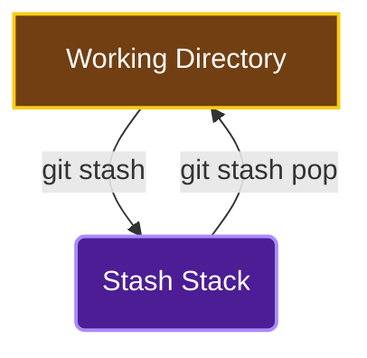
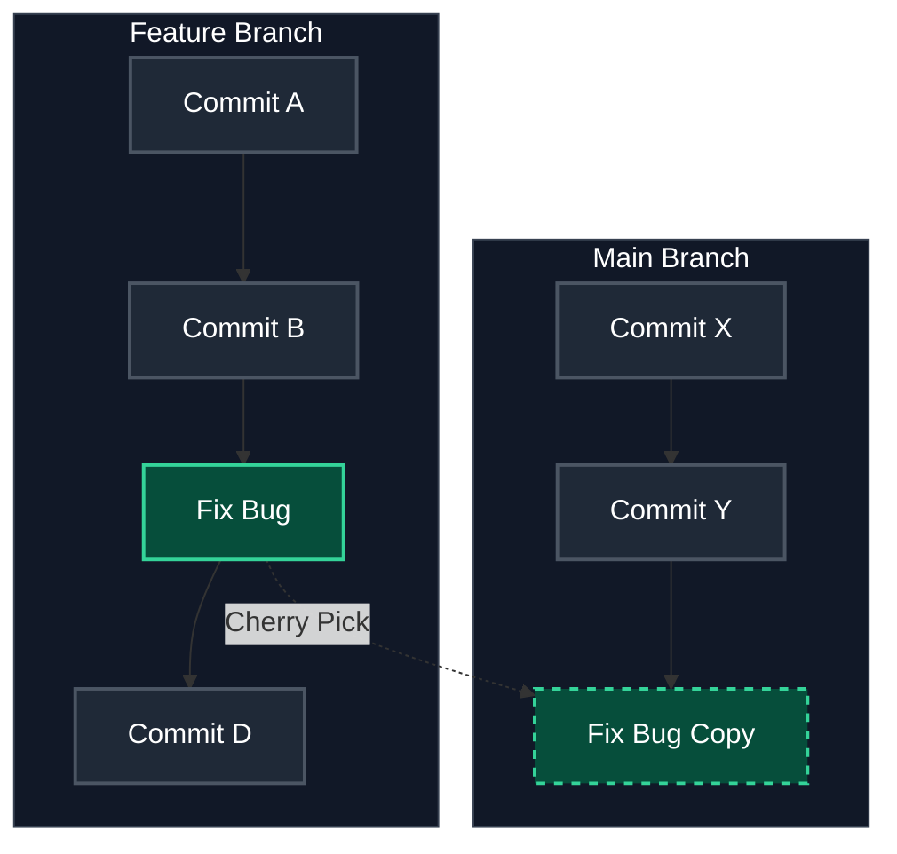
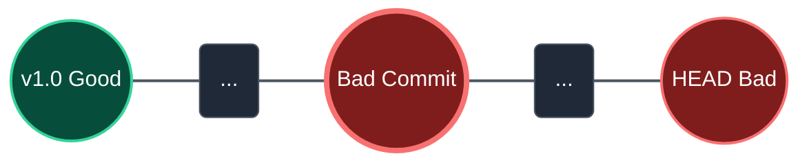
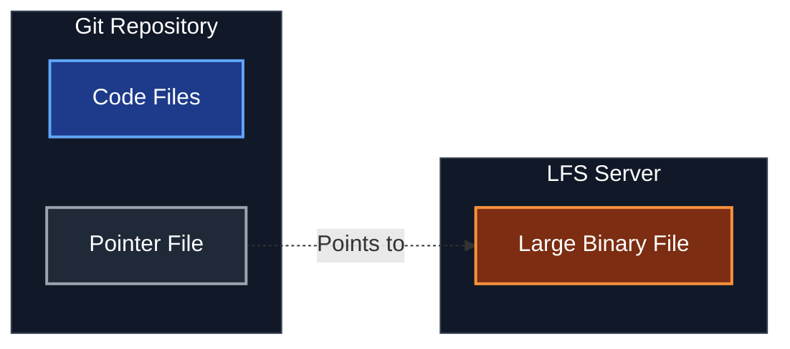

import Tooltip from "@site/src/components/Tooltip";

# مباحث تکمیلی و پیشرفته

در این بخش به سراغ ابزارهایی می‌رویم که شاید هر روز استفاده نکنید، اما دانستن آن‌ها شما را از یک کاربر معمولی به یک "مهندس گیت" تبدیل می‌کند.

## ۱. ذخیره موقت (`stash`)

**سناریو:** وسط کار روی یک ویژگی هستید، اما مدیرتان می‌گوید "فوری یک باگ در پروداکشن را حل کن!". شما نمی‌خواهید تغییرات ناقص فعلی را کامیت کنید و همچنین نمی‌خواهید آن‌ها را دور بریزید.

دستور `stash` تغییرات شما (Staged و Unstaged) را در یک فضای موقت (پشته) ذخیره می‌کند و دایرکتوری کاری را به وضعیت آخرین کامیت (Clean) برمی‌گرداند.

<div align="center">



</div>

```bash
git stash
```
حالا می‌توانید برنچ عوض کنید و باگ را فیکس کنید. وقتی برگشتید:

```bash
git stash pop
```
این دستور آخرین تغییرات ذخیره شده را برمی‌گرداند و آن را از لیست stash حذف می‌کند.

**دستورات مفید:**
*   `git stash list`: لیست تمام stashهای ذخیره شده.
*   `git stash apply`: اعمال تغییرات بدون حذف از لیست (مناسب وقتی می‌خواهید یک تغییر را روی چند برنچ تست کنید).
*   `git stash drop`: حذف یک stash خاص بدون اعمال آن.
*   `git stash -u`: ذخیره فایل‌های Untracked (که به طور پیش‌فرض stash نمی‌شوند).

## ۲. انتقال تک‌کامیت (`cherry-pick`)

**سناریو:** یک باگ را در برنچ `feature-A` حل کرده‌اید، اما این فیکس را فوری در `main` هم نیاز دارید. نمی‌خواهید کل برنچ فیچر (که هنوز کامل نیست) را ادغام کنید. فقط همان یک کامیتِ فیکس را می‌خواهید.

دستور `cherry-pick` یک کامیت خاص را کپی کرده و در برنچ فعلی اعمال می‌کند.

<div align="center">



</div>

```bash
git switch main
git cherry-pick <commit-hash>
```

:::warning تداخل (Conflict)
اگر کامیت انتخاب شده با وضعیت فعلی برنچ ناسازگار باشد، کانفلیکت رخ می‌دهد که باید آن را حل کنید.
:::

:::tip تفاوت با Revert
دستور `cherry-pick` تغییرات یک کامیت را **اعمال** می‌کند (Copy)، در حالی که `revert` تغییرات را **خنثی** می‌کند (Undo).
:::


## ۳. مشاهده تغییرات (`diff`)

تا الان احتمالاً از `git status` استفاده کرده‌اید. اما `git diff` دقیقاً به شما می‌گوید **چه خطوطی** تغییر کرده‌اند.

**سناریو:** چند ساعت روی یک ویژگی کار کرده‌اید. برخی فایل‌ها را Stage کرده‌اید و برخی را نه. قبل از کامیت، می‌خواهید دقیقاً مرور کنید چه چیزی قرار است کامیت شود و چه چیزی هنوز کار دارد.

*   **تغییرات Working Directory (هنوز Add نشده):**
```bash
git diff
```
    این دستور تفاوت بین فایل‌های شما و Staging Area را نشان می‌دهد.

*   **تغییرات Staging Area (آماده کامیت):**
```bash
git diff --staged
```
    (یا `--cached`). این دستور تفاوت بین فایل‌های Stage شده و آخرین کامیت (HEAD) را نشان می‌دهد.

*   **مقایسه دو برنچ:**
```bash
git diff main feature-branch
```
    تفاوت بین آخرین وضعیت دو برنچ را نشان می‌دهد.

:::info ابزارهای گرافیکی
خواندن خروجی متنی `diff` گاهی سخت است. می‌توانید از ابزارهای گرافیکی مثل VS Code استفاده کنید:
`git config --global diff.tool vscode`
:::

## ۴. چه کسی این خط را نوشته؟ (`blame`)

**سناریو:** به کدی برمی‌خورید که منطق عجیبی دارد و می‌خواهید بدانید چرا اینطور نوشته شده است. یا می‌خواهید بدانید چه کسی آخرین بار این فایل را تغییر داده است.

```bash
git blame <file>
```
این دستور کنار هر خط از فایل، نام نویسنده، تاریخ و شناسه کامیت (Hash) را نشان می‌دهد.

:::info ابزارهای گرافیکی
اگر از VS Code استفاده می‌کنید، اکستنشن‌هایی مثل GitLens همین اطلاعات را به صورت کمرنگ جلوی هر خط نشان می‌دهند که بسیار کاربردی است.
:::

## ۵. شکار باگ (`bisect`)

**سناریو:** پروژه الان خراب است (Bad)، اما می‌دانید که هفته پیش (مثلاً در ورژن 1.0) سالم بود (Good). بین این دو نقطه ۱۰۰ کامیت وجود دارد. کدام کامیت باعث خرابی شده؟

به جای چک کردن تک‌تک کامیت‌ها، `git bisect` با جستجوی دودویی (Binary Search) مقصر را پیدا می‌کند.

<div align="center">



</div>

1.  شروع عملیات:
```bash
git bisect start
```
2.  تعیین وضعیت فعلی (خراب):
```bash
git bisect bad
```
3.  تعیین آخرین وضعیت سالم (مثلاً تگ v1.0 یا یک هش قدیمی):
```bash
git bisect good v1.0
```
4.  حالا گیت شما را به وسط تاریخچه می‌برد. شما تست می‌کنید.
    *   اگر سالم بود: `git bisect good`
    *   اگر خراب بود: `git bisect bad`
5.  این کار تکرار می‌شود تا گیت دقیقاً کامیت خرابکار را پیدا کند.
6.  پایان عملیات و بازگشت به برنچ اصلی:
```bash
git bisect reset
```

## ۶. میان‌برها (`alias`)

تایپ کردن دستورات طولانی خسته‌کننده است. می‌توانید برای دستورات پرکاربرد، میان‌بر (Alias) بسازید.

**سناریو:** خسته شده‌اید از بس تایپ کرده‌اید `git checkout` یا `git log --graph --oneline ...`. می‌خواهید با `git co` یا `git lg` کارتان راه بیفتد.

در فایل `.gitconfig` (یا با دستور):

```bash
git config --global alias.co checkout
git config --global alias.br branch
git config --global alias.ci commit
git config --global alias.st status
```

حالا به جای `git checkout` کافیست بزنید `git co`.

**یک Alias حرفه‌ای برای لاگ زیبا:**
```bash
git config --global alias.lg "log --color --graph --pretty=format:'%Cred%h%Creset -%C(yellow)%d%Creset %s %Cgreen(%cr) %C(bold blue)<%an>%Creset' --abbrev-commit"
```
حالا با زدن `git lg` یک نمودار رنگی و زیبا از تاریخچه می‌بینید!

## ۷. زیرپروژه‌ها (`submodule`)

**سناریو:** شما روی پروژه اصلی کار می‌کنید، اما نیاز دارید از یک کتابخانه یا پروژه دیگر (که خودش یک ریپازیتوری گیت جداگانه است) استفاده کنید. نمی‌خواهید کد آن را کپی-پیست کنید چون می‌خواهید آپدیت‌های آن را هم دریافت کنید.

**Submodule** به شما اجازه می‌دهد یک ریپازیتوری گیت را به عنوان یک پوشه داخل ریپازیتوری دیگر نگه دارید.

### اضافه کردن Submodule
```bash
git submodule add <url-to-repo> <path/to/folder>
```

مثال:

```bash
git submodule add https://github.com/twbs/bootstrap.git themes/bootstrap
```
این کار یک فایل `.gitmodules` می‌سازد که آدرس زیرپروژه را نگه می‌دارد.

### کلون کردن پروژه‌ای که Submodule دارد
اگر فقط `git clone` بزنید، پوشه ساب‌ماژول خالی خواهد بود! باید آن‌ها را اینیشیالایز کنید:

```bash
git clone --recursive <url-to-project>
```
یا اگر قبلاً کلون کرده‌اید:
```bash
git submodule update --init --recursive
```

### آپدیت کردن
```bash
git submodule update --remote
```

<div align="center">


</div>

:::danger نکته مهم
ساب‌ماژول‌ها روی یک کامیت خاص قفل می‌شوند (نه روی یک برنچ). اگر داخل پوشه ساب‌ماژول بروید، در حالت `Detached HEAD` هستید. برای آپدیت کردن آن به آخرین نسخه، باید داخل آن پوشه بروید، `git pull` بزنید و سپس در پروژه اصلی تغییرِ هشِ ساب‌ماژول را کامیت کنید.
:::

## ۸. فایل‌های حجیم (`LFS`)

**سناریو:** شما بازی‌ساز هستید یا روی پروژه‌ای کار می‌کنید که فایل‌های باینری بزرگ (PSD, MP4, Models) دارد. گیت برای فایل‌های متنی عالی است، اما با فایل‌های حجیم کند می‌شود و حجم ریپازیتوری منفجر می‌شود.

**Git LFS (Large File Storage)** جایگزینی است که فایل‌های بزرگ را در سرور جداگانه‌ای ذخیره می‌کند و در گیت فقط یک "اشاره‌گر" (Pointer) متنی کوچک نگه می‌دارد.

### نصب و راه‌اندازی
1.  نصب LFS (فقط یک بار روی سیستم):
```bash
git lfs install
```
2.  مشخص کردن فایل‌های حجیم (در پروژه):
```bash
git lfs track "*.psd"
git lfs track "*.mp4"
```
    این دستور فایل `.gitattributes` را می‌سازد/آپدیت می‌کند.

3.  کامیت کردن فایل `.gitattributes`:
```bash
git add .gitattributes
git commit -m "Add LFS tracking"
```

حالا وقتی فایل PSD را کامیت و پوش می‌کنید، فایل اصلی به سرور LFS می‌رود و گیت سبک باقی می‌ماند.

<div align="center">



</div>

:::info محدودیت‌ها
سرویس‌های گیت (مثل GitHub یا GitLab) معمولاً محدودیت حجم و پهنای باند برای LFS دارند (مثلاً ۱ گیگابایت رایگان).
:::
